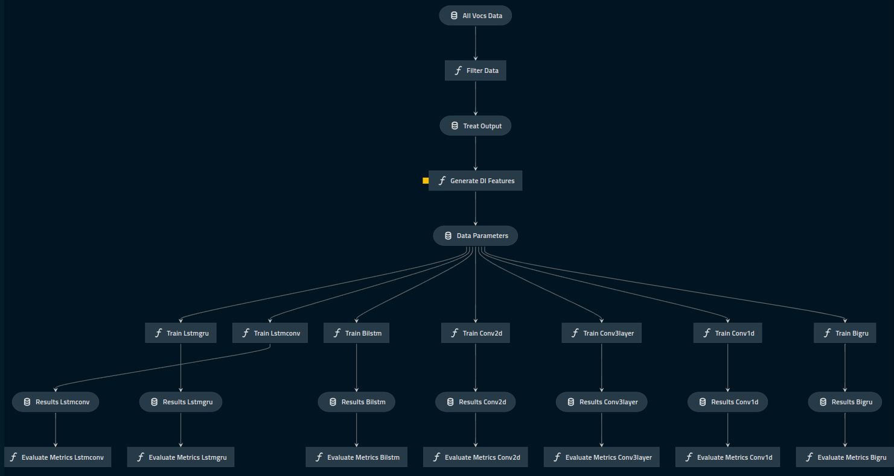

# unknown_sequence_classification

## Overview

This project aims at find patterns in the Spike protein sequences of the SARS-CoV-2 virus that may possibly separate severe from mild cases of COVID-19. In this project, seven deep learning architectures and reported the accuracy and precision metrics for each of the these models. To see more details about the project and compiled results see the jupyter notebook.


## Installing
### Using a conda environment
- Edit the yml environment file with the directory for your conda
- Create conda environment: ```conda env create -f unknown_classification.yml```
- Activate environment: ``` conda activate unknown_classification ```

### Or using only kedro
- ```pip install -r src/requirements.txt```

### Configure mlflow to see the exported metrics
- Initalize the mlflow kedro service to monitore the execution and metrics exportation: ```kedro mlflow init```

## Visualize the workflow
- ```kedro viz```

## Running
1. Run all:  ``` kedro run ``` 
2. Run bidirectional GRU:  ``` kedro run --pipeline=model_bigru``` 
3. Run bidirectional LSTM:  ``` kedro run --pipeline=model_bilstm``` 
4. Run convolution 1D:  ``` kedro run --pipeline=model_conv1d```  
5. Run convolution 2D:  ``` kedro run --pipeline=model_conv2d```   
6. Run convolution 1D three layers:  ``` kedro run --pipeline=model_conv3layer``` 
7. Run LSTM + GRU:  ``` kedro run --pipeline=model_lstmgru``` 
8. Run LSTM + Convolution:  ``` kedro run --pipeline=model_lstmconv``` 

## Monitoring the metrics from each execution
- ```kedro mlflow ui```

